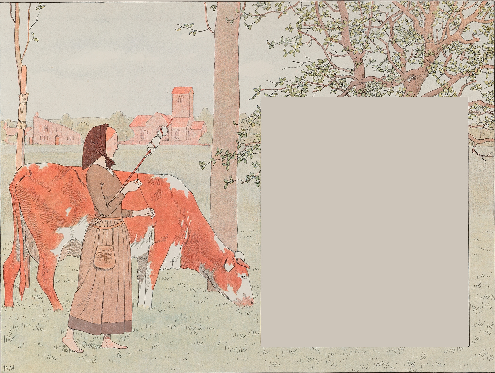
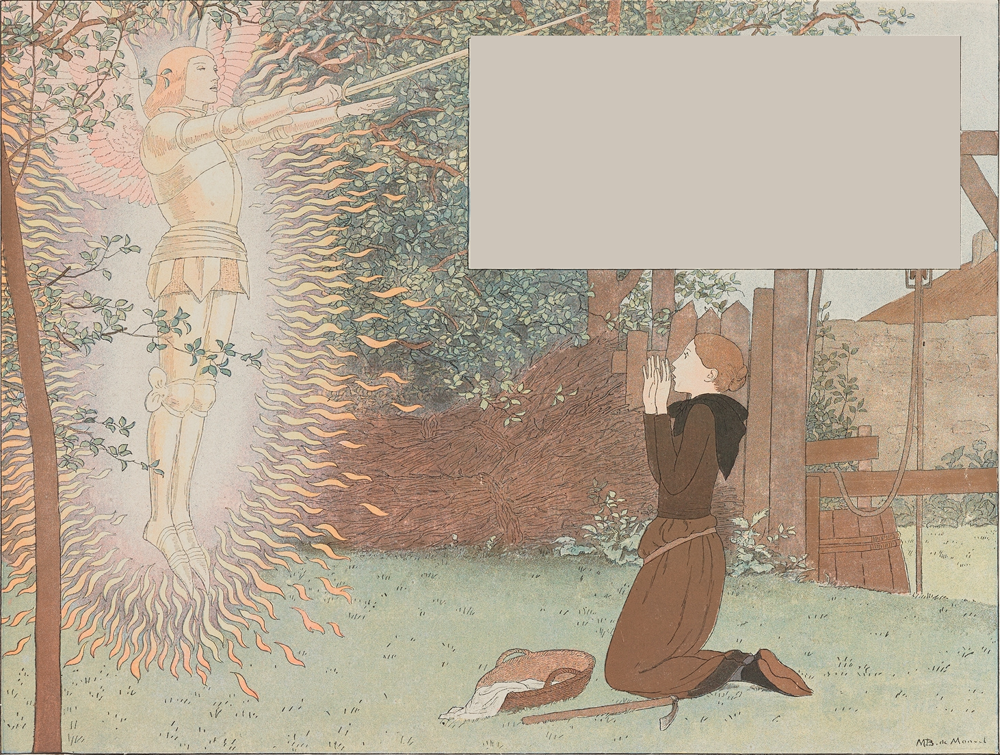

[back](index.html)

# Η Ηρωική Μάρτυς για την Αλήθεια

- As [video](https://www.youtube.com/watch?v=vVMf3Y-GOXk&list=PLrZFPVQM38MeC-ecXR6xoUe730yGpoLlv)
- As [slides](https://docs.google.com/presentation/d/1VCVcJ-jBY2l14-xzNCqH2_aV54vp0vJQbBLlc67frQE/edit?usp=sharing)

# Πράξη 1

---
## Πρόλογος

      
Στις 22 Οκτωβρίου 1422, ο Κάρολος ΣΤ' πέθανε, αφήνοντας, με τη Συνθήκη της Τρουά, το βασίλειό του με το χέρι της κόρης του στον Ερρίκο Ε', βασιλιά της Αγγλίας.

Στον αιώνα από τότε που ο πόλεμος κατέστρεψε τη χώρα μας, ποτέ η ανεξαρτησία μας δεν απειλήθηκε τόσο.

Κυρίαρχοι της Γκυέν, ενωμένοι από τη μία με τον Δούκα της Βουργουνδίας, από την άλλη υποστηριζόμενοι από τον Δούκα της Βρετάνης, οι Άγγλοι κατείχαν τον βορρά και το κέντρο της Γαλλίας, μέχρι το Λίγηρα.

Η Ορλεάνη, πολιορκημένη, παρουσίαζε ένα τελικό εμπόδιο στην πορεία τους προς το νότο· αλλά η πόλη χωρίς βοήθεια επρόκειτο να υποκύψει.

Ο Δελφίνος Κάρολος Ζ' είχε καταφύγει στη Βουργία: ένας λυπημένος βασιλιάς, χωρίς στρατό, χωρίς χρήματα, χωρίς ενέργεια. Λίγοι αυλικοί ανταγωνίζονταν ακόμα για τις τελευταίες χάρες αυτής της καταρρέουσας μοναρχίας, αλλά κανένας από αυτούς δεν ήταν ικανός να την υπερασπιστεί, και, μέσα από την πεινασμένη ύπαιθρο, τα υπολείμματα του βασιλικού στρατού, συμμορίες πολεμιστών από διάφορες πηγές, μειωμένες και αποθαρρυμένες από τις πρόσφατες ήττες τους στο Κραβάν και το Βερνέιγ, υποχώρησαν ανίκανες για μια νέα προσπάθεια.

Όλα έλειπαν: άνδρες, πόροι, ακόμα και η θέληση να αντισταθούν. Ο Κάρολος ΣΤ', απογοητευμένος από την υπόθεσή του, σκέφτηκε να φύγει στο Δελφινάτο, ίσως και πέρα από τα βουνά, στην Καστίλη, εγκαταλείποντας το βασίλειό του, τα δικαιώματά του, και τα καθήκοντά του.

Μετά την τρέλα του Καρόλου ΣΤ', η αδιαφορία του Δελφίνου, και η ιδιοτέλεια και η ανικανότητα της αριστοκρατίας, ολοκλήρωσαν την καταστροφή της χώρας, η ίδια η φυλή μας επρόκειτο να χάσει την εθνικότητά της.

Τότε, στα σύνορα της Λωραίνης, σε ένα απομακρυσμένο χωριό, ένα μικρό χωριατόπουλο σηκώθηκε. Συγκινημένη από τις δυστυχίες των φτωχών ανθρώπων της Γαλλίας, είχε αισθανθεί στα βάθη της καρδιάς της το πρώτο ρίγος της πατρίδας. Με το αδύναμο χέρι της, πήρε το μεγάλο σπαθί της νικημένης Γαλλίας, και, με το αδύναμο στήθος της κάνοντας προπύργιο ενάντια σε τόσο πόνο, άντλησε από την ενέργεια της πίστης της τη δύναμη να ανασηκώσει το χαμένο κουράγιο και να ξεριζώσει τη χώρα μας από τους νικηφόρους Άγγλους.

«Έρχομαι από τον Κύριο Θεό μου», είπε, «για να σώσω το βασίλειο της Γαλλίας.»

Και πρόσθεσε: «Γι' αυτό γεννήθηκα.»

Για αυτό, πράγματι, γεννήθηκε, η αγία κοπέλα· αυτός είναι επίσης ο λόγος για τον οποίο, παραδομένη δειλά στους εχθρούς της, πέθανε στον τρόμο του πιο φρικτού βασανισμού, εγκαταλειμμένη από τον βασιλιά που είχε στέψει και τον λαό που είχε σώσει.

Ανοίξτε, αγαπητά μου παιδιά, αυτό το βιβλίο με ευλάβεια στη μνήμη αυτής της ταπεινής χωριατοπούλας που είναι η προστάτιδα της Γαλλίας, που είναι η αγία της πατρίδας όπως ήταν ο μάρτυράς της. Η ιστορία της θα σας πει ότι για να νικήσετε, πρέπει να έχετε πίστη στη νίκη. Θυμμήσου αυτό, την ημέρα που η χώρα θα χρειαστεί όλο το κουράγιό σου.

---

## Σκηνή 1

Η Ιωάννα γεννήθηκε στις 6 Ιανουαρίου 1412, στο Ντομρεμί, ένα μικρό χωριό στη Λωρραίνη, εξαρτώμενο από το δικαστήριο της Σωμόν, που υπαγόταν στο στέμμα της Γαλλίας.

Το όνομα του πατέρα της ήταν Ζακ ντ'Αρκ, και η μητέρα της ήταν Ισαβέλλα Ρομέε· ήταν έντιμοι άνθρωποι, απλοί εργάτες που ζούσαν από την εργασία τους.

Η Ιωάννα ανατράφηκε με τα αδέλφια και την αδελφή της σε ένα μικρό σπίτι που ακόμα υπάρχει στο Ντομρεμί, τόσο κοντά στην εκκλησία που ο κήπος του αγγίζει το νεκροταφείο.

Το παιδί μεγαλώνει εκεί υπό το βλέμμα του Θεού.

Ήταν γλυκιά, απλή και ειλικρινής. Όλοι την αγαπούσαν επειδή ήξεραν ότι ήταν φιλάνθρωπη και το καλύτερο κορίτσι στο χωριό της. Εργατική, βοηθούσε την οικογένειά της στις δουλειές τους, κατά τη διάρκεια της ημέρας οδηγώντας τα ζώα στο βοσκότοπο, ή συμμετέχοντας στη σκληρή εργασία του πατέρα της, το βράδυ περνώντας χρόνο με τη μητέρα της και βοηθώντας την στις οικιακές φροντίδες.

Αγαπούσε τον Θεό και προσευχόταν συχνά σε Αυτόν.

---

## Σκηνή 2

Μια καλοκαιρινή μέρα, όταν ήταν δεκατριών ετών, καθώς ήταν μεσημέρι, άκουσε μια φωνή στον κήπο του πατέρα της· ένα μεγάλο φως ξέσπασε, και ο αρχάγγελος Άγιος Μιχαήλ της εμφανίστηκε. Της είπε να είναι καλή και να πηγαίνει στην εκκλησία. Στη συνέχεια, λέγοντάς της για τη μεγάλη λύπη που υπήρχε στο βασίλειο της Γαλλίας, της ανακοίνωσε ότι θα πήγαινε σε βοήθεια του Δελφίνου και ότι θα τον οδηγούσε στη Ρεμς για τη στέψη του.

"Κύριε, είμαι μόνο ένα φτωχό κορίτσι, δεν μπορώ να ιππεύσω ή να οδηγήσω άνδρες στα όπλα."

"Ο Θεός θα σε βοηθήσει", απάντησε ο αρχάγγελος.

Και το ταραγμένο παιδί έμεινε κλαίγοντας.

---

## Σκηνή 3

Από εκείνη την ημέρα, η ευσέβεια της Ιωάννας έγινε ακόμη πιο έντονη· Το παιδί χωριζόταν πρόθυμα από τους συντρόφους της για να μελετήσει, και οι ουράνιες φωνές ακούγονταν, μιλώντας της για την αποστολή της. Ήταν, είπε, οι φωνές των Αγίων της. Συχνά αυτές οι φωνές συνοδεύονταν από οράματα· η Αγία Αικατερίνη και η Αγία Μαργαρίτα της εμφανίζονταν.

“Τις έβλεπα με τα μάτια του σώματός μου,” είπε αργότερα στους κριτές της, “και όταν με άφηναν, έκλαιγα· θα ήθελα να με πάρουν μαζί τους.”

Το παιδί μεγάλωσε, το πνεύμα της υψώθηκε από τα οράματά της και κρατούσε βαθιά στην καρδιά της το μυστικό των ουράνιων συνομιλιών της.  Κανείς δεν υποπτευόταν τι συνέβαινε μέσα της, ούτε καν ο ιερέας που άκουγε την εξομολόγησή της.

Στις αρχές του 1428, η Ιωάννα ήταν δεκαοκτώ ετών, και οι φωνές έγιναν πιο επιτακτικές.

“Ο κίνδυνος είναι μεγάλος, η Ιωάννα πρέπει να φύγει για να βοηθήσει τον Βασιλιά και να σώσει το βασίλειο.”

Οι Άγιοι της διέταξαν να πάει να βρει τον Άρχοντα του Μποδρικόρ, Άρχοντα του Βωκουλέρ, και να του ζητήσει μια συνοδεία που θα την πάρει στον Δελφίνο.

Μη τολμώντας να μοιραστεί το σχέδιό της με τους γονείς της, η Ιωάννα πήγε στο Μπουρέι για να βρει τον θείο της Λαξάρτ και τον παρακάλεσε να την πάει στο Βωκουλέρ. Ο ζήλος της προσευχής της συγκλόνισε την ντροπαλότητα του φοβισμένου αγρότη· της υποσχέθηκε να την συνοδεύσει.

---

## Σκηνή 4

Η υποδοχή του Μποδρικόρ ήταν βάναυση. Η Ιωάννα του είπε "ότι ένα μήνυμα ήρθε από τον Θεό, ότι ο Θεός θα διέταζε τον Δελφίνο να φερθεί καλά γιατί ο Κύριος θα του δώσει βοήθεια πριν από τη μέση της Σαρακοστής"· πρόσθεσε "ότι ο Θεός ήθελε ο Δελφίνος να γίνει βασιλιάς· ότι θα το έκανε παρά τους εχθρούς του, και ότι η ίδια θα τον οδηγούσε στη στέψη".

"Αυτή η κοπέλα είναι τρελή, είπε ο Μποδρικόρ, ας την πάμε πίσω στον πατέρα της για να της δώσει μερικές καλές σφαλιάρες."

Η Ιωάννα επέστρεψε στο Ντομρεμί. Αλλά, πιεζόμενη ξανά από τις φωνές της, επέστρεψε στο Βωκουλέρ και είδε ξανά τον Άρχοντα του Μποδρικόρ χωρίς να λάβει μία καλύτερη υποδοχή.

---

## Σκηνή 5

Αλλά αυτή τη φορά έμεινε στο Βωκουλέρ.

Σύντομα, ο μόνος θόρυβος στη χώρα ήταν για αυτή τη νεαρή κοπέλα, που γύριζε λέγοντας δυνατά ότι θα έσωζε το βασίλειο, ότι πρέπει να την πάρουν στον Δελφίνο, ότι ο Θεός το ήθελε.

“Θα πάω,” είπε, “ακόμα κι αν φθείρω τα πόδια μου μέχρι τα γόνατα.”

Οι άνθρωποι, με απλές καρδιές, συγκινημένοι από την πίστη της, την πίστεψαν. Ένας ιππότης, ο Ζαν ντε Μετς, κερδισμένος από την εμπιστοσύνη του πλήθους, προσφέρθηκε να την πάει στο Σινόν, όπου ήταν ο Κάρολος Ζ'. Οι φτωχοί, ενώνοντας τις δυστυχίες τους, ενώθηκαν για να ντύσουν και να οπλίσουν το μικρό κορίτσι του χωριού. Της αγόρασαν ένα άλογο, και την ορισμένη ημέρα αναχώρησε με τη μικρή συνοδεία της.

“Πήγαινε. Και ό,τι γίνει!” της πέταξε ο Μποδρικόρ.

"Ο Θεός να σε ευλογίσει!" φώναξαν οι φτωχοί άνθρωποι, και οι γυναίκες έκλαιγαν καθώς την έβλεπαν να φεύγει.

---

## Σκηνή 6

Το Σινόν ήταν μακριά και το ταξίδι επικίνδυνο. Οι Άγγλοι και οι Βουργουνδοί υποστηρικτές κατείχαν τη χώρα, και η μικρή ομάδα έπρεπε να περάσει από ορισμένες γέφυρες που κατείχαν οι εχθροί. Έπρεπε να περπατήσουν τη νύχτα και να κρυφτούν κατά τη διάρκεια της ημέρας. Οι σύντροφοι της Ιωάννας, τρομαγμένοι, μίλησαν για επιστροφή στο Βωκουλέρ.

"Μην φοβάστε," τους είπε, "ο Θεός μου δείχνει τον δρόμο μου, τα αδέλφια μου στον παράδεισο μου λένε τι πρέπει να κάνω."

Τη δωδέκατη ημέρα, η Ιωάννα έφτασε στο Σινόν με τους συντρόφους της. Από τον οικισμό της Αγίας Αικατερίνης, είχε στείλει μια επιστολή στον Βασιλιά αναγγέλλοντας την άφιξή της.

Η αυλή του Καρόλου Ζ' δεν ήταν καθόλου ενιαία ως προς την υποδοχή που έπρεπε να της δοθεί. Ο Λα Τρεμούιγ, ο αγαπημένος της ημέρας, ζηλιάρης για την υπεροχή που είχε αποκτήσει πάνω στον αφέντη του, ήταν αποφασισμένος να αφαιρέσει κάθε επιρροή ικανή να αποσπάσει τον Κάρολο από την νωθρότητά του. Για δύο μέρες, το συμβούλιο συζήτησε για το αν ο Δελφίνος θα δεχόταν τη νεαρή εμπνευσμένη γυναίκα.

---

## Σκηνή 7

Εκείνη τη στιγμή, ήρθαν νέα από την Ορλεάνη τόσο ανησυχητικά που οι υποστηρικτές της Ιωάννας κατάφεραν να διασφαλίσουν ότι αυτή η ύστατη ευκαιρία σωτηρίας δεν θα αποκλειστεί. Το βράδυ, με το φως πενήντα δαυλών, στην μεγάλη αίθουσα του κάστρου, όπου όλοι οι άρχοντες της αυλής είχαν συγκεντρωθεί, παρουσιάστηκε η Ιωάννα. Δεν είχε δει ποτέ τον Βασιλιά. Ο Κάρολος Ζ', για να μην τραβήξει την προσοχή της, φορούσε ένα λιγότερο πολυτελές κοστούμι από αυτά των αυλικών του. Με την πρώτη ματιά, τον διέκρινε ανάμεσα σε όλους, και γονατίζοντας μπροστά του:

«Ο Θεός να σε ευλογεί, καλέ Δελφίνε!» του λέει.

"Δεν είμαι εγώ ο Βασιλιάς," απάντησε, "αυτός είναι ο Βασιλιάς." Και της έδειξε έναν άρχοντα.

"Εσύ είσαι, καλέ πρίγκιπα, και κανένας άλλος· ο Βασιλιάς των Ουρανών σου στέλνει μήνυμα μέσω εμένα ότι θα στεφθείς."

Και πλησιάζοντας το αντικείμενο της αποστολής της, του είπε ότι ο Θεός την είχε στείλει για να βοηθήσει και να τον ενισχύσει· ζήτησε να της δώσει έναν στρατό, υποσχόμενη να άρει την πολιορκία της Ορλεάνης και να τον πάρει στη Ρεμς.

Ο Δελφίνος παρέμεινε διστακτικός. Αυτή η κοπέλα θα μπορούσε να είναι μάγισσα. Την έστειλε στο Πουατιέ για να υποβληθεί σε εξέταση από γιατρούς και εκκλησιαστικούς.

---

## Σκηνή 8

Για τρεις εβδομάδες τη βασάνιζαν με δόλιες ερωτήσεις.

“Υπάρχουν περισσότερα στο βιβλίο του Θεού από ό,τι στο δικό σας,” απάντησε· “δεν ξέρω ούτε το Α ούτε το Β, αλλά έρχομαι από τον Βασιλιά των Ουρανών.”

Όταν της αντέτειναν ότι ο Θεός, για να ελευθερώσει τη Γαλλία, δεν χρειαζόταν ένοπλους άνδρες, σηκώθηκε ξαφνικά:

“Οι άνδρες θα πολεμήσουν, ο Θεός θα δώσει τη νίκη.”

Εκεί, όπως και στο Βωκουλέρ, οι άνθρωποι δήλωσαν τον εαυτό τους υπέρ της, τη θεωρούσαν αγία και εμπνευσμένη. Οι γιατροί και οι ισχυροί αναγκάστηκαν να υποκύψουν στον ενθουσιασμό του πλήθους.

---

## Σκηνή 9

Τα στρατεύματα συγκεντρώθηκαν στο Μπλουά. Η Ιωάννα έφτασε εκεί συνοδευόμενη από τον Δούκα του Αλανσόν, τον Στρατάρχη του Μπουσάκ, τον Άρχοντα του Ρε, τον Λα Ιρ και τον Ζαντραγί.

Στο λευκό της σταντάρ είχε την εικόνα του Θεού και τα ονόματα Ιησούς και Μαρία κεντημένα. Συμβούλευε τους στρατιώτες της να εξετάσουν τη συνείδησή τους και να εξομολογηθούν πριν βγουν να πολεμήσουν. Την Πέμπτη, 28 Απριλίου, ο μικρός στρατός αναχώρησε. Η Ιωάννα ηγείτο, το σταντάρ της στον άνεμο, με το τραγούδι "Veni, Creator".

Ήθελε να βαδίσει κατευθείαν προς την Ορλεάνη· οι αρχηγοί σκέφτηκαν ότι ήταν πιο συνετό να πάνε μέσω της αριστερής όχθης του Λίγηρα.

---

## Σκηνή 10

Ο στρατός και το κομβόι έφτασαν μπροστά από το Σέσι, δύο λεύγες πάνω από την Ορλεάνη.

Ήταν θέμα να διασχίσουν τον Λίγηρα· έλειπαν τα σκάφη. Η Ιωάννα μεταφέρθηκε στην άλλη όχθη με μέρος της συνοδείας της και το κομβόι των προμηθειών. Τα υπόλοιπα στρατεύματα έπρεπε να επιστρέψουν στο Μπλουά, για να επιστρέψουν στην Ορλεάνη μέσω της δεξιάς όχθης του Λίγηρα, μέσω της Μποσέ.

---

## Σκηνή 11

Η Ιωάννα είχε πει στον Ντουνουά, που είχε έρθει να την συναντήσει:

"Σου φέρνω την καλύτερη βοήθεια, τη βοήθεια του Βασιλιά των Ουρανών· δεν έρχεται από εμένα, αλλά από τον ίδιο τον Θεό, που, με την παρέμβαση του Αγίου Λουδοβίκου και του Καρλομάγνου, λυπήθηκε την πόλη της Ορλεάνης."

Στις οκτώ το βράδυ, η Ιωάννα μπήκε στην Ορλεάνη. Οι άνθρωποι έσπευσαν να την συναντήσουν. Με το φως των δαυλών, διέσχισε την πόλη στη μέση ενός πλήθους τόσο πυκνού που δυσκολεύτηκε να περάσει. Όλοι, άντρες, γυναίκες και παιδιά, ήθελαν να την πλησιάσουν ή τουλάχιστον να αγγίξουν το άλογό της, δείχνοντας "τόση μεγάλη χαρά σαν να είχαν δει τον Θεό να κατεβαίνει ανάμεσά τους."

"Ένιωσαν, λέει το ημερολόγιο της πολιορκίας, ανακουφισμένοι και σαν να είχαν απαλλαγεί από τη θεϊκή δύναμη αυτού του απλού κοριτσιού."

Η Ιωάννα τους μίλησε ευγενικά, υποσχόμενη να τους ελευθερώσει.

---

## Σκηνή 12

Ζήτησε να την πάνε σε μια εκκλησία, θέλοντας πάνω απ' όλα να ευχαριστήσει τον Θεό.

Όταν ένας ηλικιωμένος άνδρας είπε στην Ιωάννα, μιλώντας για τους Άγγλους:

"Κόρη μου, είναι δυνατοί και καλά οχυρωμένοι, και θα είναι μεγάλο πράγμα να τους βγάλουμε από τη μέση," απάντησε: "Δεν υπάρχει τίποτα αδύνατο στη δύναμη του Θεού."

Και, στην πραγματικότητα, η εμπιστοσύνη της κέρδισε όλους γύρω της. Οι Ορλεανείς, τόσο φοβισμένοι και αποθαρρυμένοι την προηγούμενη μέρα, τώρα φανατισμένοι από την παρουσία της, ήθελαν να επιτεθούν στον εχθρό και να αφαιρέσουν τις βάσεις τους. Ο Ντουνουά, φοβούμενος την αποτυχία, αποφάσισε να περιμένουν την άφιξη του στρατού ανακούφισης για να ξεκινήσουν την επίθεση. Στο μεταξύ, η Ιωάννα κάλεσε τους Άγγλους να αποσυρθούν και να επιστρέψουν στη χώρα τους. Αυτοί απάντησαν με προσβολές.

---

## Σκηνή 13

Ωστόσο, δεν λάβαμε νέα από το Μπλουά. Ο Ντουνουά, ανήσυχος, έφυγε για να επισπεύσει την άφιξη της βοήθειας. Ήταν καιρός. Ο αρχιεπίσκοπος της Ρεμς, Ρενώλντ ντε Σαρτρ, καγκελάριος του βασιλιά, αναθεωρώντας τις ληφθείσες αποφάσεις, επρόκειτο να στείλει τα στρατεύματα πίσω στις φρουρές τους. Ο Ντουνουά κατάφερε να τα πάει στην Ορλεάνη.

Την Τετάρτη, 4 Μαΐου, το πρωί, η Ιωάννα, περιβαλλόμενη από όλον τον κλήρο της πόλης και ακολουθούμενη από μεγάλο μέρος του πληθυσμού, έφυγε από την Ορλεάνη· μέσα από τα αγγλικά φρούρια, προχώρησε σε μια μεγαλοπρεπή πομπή για να συναντήσει τον μικρό στρατό του Ντουνουά, ο οποίος πέρασε υπό την προστασία των ιερέων και ενός κοριτσιού, χωρίς οι Άγγλοι να τολμήσουν να τον επιτεθούν.

---

## Σκηνή 14

Την ίδια μέρα, καθώς η Ιωάννα αναπαυόταν, ξύπνησε ξαφνικά.

"Ω! Θεέ μου," φώναξε, "το αίμα του λαού μας χύνεται στο έδαφος!... Είναι λάθος! Γιατί δεν με ξύπνησαν; Γρήγορα, τα όπλα μου, το άλογό μου!"

Βοηθούμενη από τις γυναίκες του σπιτιού, οπλίστηκε γρήγορα και, πηδώντας στη σέλα, έφυγε καλπάζοντας, με το σταντάρ της στο χέρι, τρέχοντας κατευθείαν προς την Πύλη της Βουργουνδίας, τόσο γρήγορα που πετάγονταν σπινθήρες από το πλακόστρωτο.

---

## Σκηνή 15

Στην πραγματικότητα, χωρίς να την ειδοποιήσουν, είχε επιτεθεί το φρούριο του Αγίου Λουπ. Η επίθεση είχε αποτύχει· οι Γάλλοι υποχωρούσαν ατακτοποίητα. Η Ιωάννα έτρεξε να τους συγκεντρώσει και, επιστρέφοντας τους στον εχθρό, επανέλαβε την επίθεση. Ο Ταλομπότ προσπάθησε μάταια να βοηθήσει τους ανθρώπους του. Η Ιωάννα, στέκοντας στους πρόποδες των τειχών, ενθάρρυνε τον λαό της. Για τρεις ώρες οι Άγγλοι αντιστάθηκαν. Παρά την απελπισμένη τους άμυνα, το φρούριο καταλήφθηκε.

---

## Σκηνή 16

Η Ιωάννα επέστρεψε νικηφόρα στην Ορλεάνη. Αλλά καθώς, μέσα στη χαρά της επιτυχίας της, επέστρεφε προς την πόλη, διασχίζοντας το πεδίο της μάχης, ένιωσε την καρδιά της να λιώνει από οίκτο στη θέα των τραυματισμένων και των νεκρών, και άρχισε να κλαίει, σκεπτόμενη ότι είχαν πεθάνει χωρίς εξομολόγηση. Και είπε "ότι ποτέ πριν δεν είχε δει το αίμα της Γαλλίας να χύνεται. Τα μαλλιά της σηκώθηκαν όρθια."

---

## Σκηνή 17

Ωστόσο, ήταν ζήτημα να αποφασιστεί πώς θα συνεχιζόταν αυτή η επίθεση που είχε αρχίσει τόσο ευτυχώς εναντίον των Άγγλων.

Οι αρχηγοί, απρόθυμοι να καθοδηγηθούν από ένα κορίτσι του χωριού ή να μοιραστούν μαζί της τη δόξα της επιτυχίας, συναντήθηκαν κρυφά για να συζητήσουν το σχέδιο που θα υιοθετούσαν.

Η Ιωάννα παρουσιάστηκε στο συμβούλιο· και καθώς ο καγκελάριος του Δούκα της Ορλεάνης προσπάθησε να κρύψει από αυτήν τις αποφάσεις που είχαν ληφθεί:

“Πείτε τι έχετε συμπεράνει και πείτε,” φώναξε, αγανακτισμένη από αυτές τις παρακάμψεις· “μπορώ να κρύψω κάτι μεγαλύτερο!” πρόσθεσε:

"Ήσασταν στο συμβούλιό σας και εγώ ήμουν στο δικό μου, και πιστέψτε ότι το συμβούλιο του Θεού θα εκπληρωθεί και θα παραμείνει σταθερό, και ότι το δικό σας θα καταρρεύσει. Ξυπνήστε νωρίς αύριο το πρωί, γιατί θα έχω πολλά να κάνω, περισσότερα από όσα είχα ποτέ."

---

## Σκηνή 18

Την επόμενη μέρα, 6 Μαΐου, κατέλαβε το φρούριο των Αυγουστινών. Το Σάββατο 7, νωρίς το πρωί, άρχισε η επίθεση στο φρούριο των Τουρνέλ. Η Ιωάννα, κατεβασμένη στη τάφρο, ανέβαζε μια σκάλα στο στηθαίο, όταν μια βολή τόξου την τρύπησε ανάμεσα στο λαιμό και τον ώμο. Αφαίρεσε το σίδερο από την πληγή· της προσφέρθηκε τότε να μαγέψει την πληγή, αρνήθηκε, λέγοντας "ότι θα προτιμούσε να πεθάνει παρά να κάνει κάτι που ήταν αντίθετο με το θέλημα του Θεού". Εξομολογήθηκε και προσευχήθηκε για πολύ ώρα ενώ τα στρατεύματά της ξεκουράζονταν. Στη συνέχεια, δίνοντας εντολή να ξαναρχίσει η επίθεση, έπεσε στη μάχη, φωνάζοντας στους επιτιθέμενους:

“Είναι δικό σας, μπείτε!”

Το φρούριο καταλήφθηκε και όλοι οι υπερασπιστές χάθηκαν. Δεν υπήρχε πια Άγγλος στην αριστερή όχθη του Λίγηρα.

---

## Σκηνή 19

Την Κυριακή, οι Άγγλοι παρατάχθηκαν σε μάχη στη δεξιά όχθη του Λίγηρα. Η Ιωάννα απαγόρευσε να τους επιτεθούν. Είχε ένα βωμό ανεγερμένο, και Θεία λειτουργία τελέστηκε παρουσία του συναθροισμένου στρατού. Η τελετή τελείωσε, είπε στους γύρω της:

“Δείτε αν οι Άγγλοι έχουν τα πρόσωπά τους στραμμένα προς εμάς ή τις πλάτες τους!” Και καθώς της είπαν ότι υποχωρούσαν προς την κατεύθυνση του Μεν:

"Στο όνομα του Θεού, αν φεύγουν, αφήστε τους να φύγουν· δεν ευχαριστεί τον Κύριο Θεό να τους πολεμήσουμε σήμερα, θα τους έχουμε κάποια άλλη φορά."

Η Ορλεάνη, πολιορκημένη για οκτώ μήνες, παραδόθηκε σε τέσσερις μέρες.

---

## Σκηνή 20

Τα νέα της απελευθέρωσης της Ορλεάνης διαδόθηκαν παντού, επιβεβαιώνοντας τη θεότητα της αποστολής της Ιωάννας.

Η αγία κοπέλα, αποφεύγοντας την αναγνώριση των Ορλεανών, επέστρεψε βιαστικά στο Σινόν. Ήθελε, εκμεταλλευόμενη τον ενθουσιασμό που ξεσήκωσε γύρω της, να φύγει αμέσως για τη Ρεμς, παίρνοντας τον Βασιλιά μαζί της για να τον στεφθεί. Ο Βασιλιάς την υποδέχθηκε με μεγάλες τιμές, αλλά αρνήθηκε να την ακολουθήσει. Δέχθηκε την αφοσίωση αυτής της ηρωικής κοπέλας, αλλά καταλάβαινε ότι οι γενναιόδωρες προσπάθειές της δεν θα διατάρασσαν σε καμία περίπτωση την δειλή αδράνεια της βασιλικής της ύπαρξης.

Αποφασίστηκε ότι η Ιωάννα θα επιτεθεί στα μέρη που οι Άγγλοι ακόμα κρατούσαν στις όχθες του Λίγηρα.

---

## Σκηνή 21

Στις 11 Ιουνίου, οι Γάλλοι κατέλαβαν τα προάστια του Ζαρζό. Την επόμενη μέρα, νωρίς το πρωί, η Ιωάννα έδωσε το σήμα για μάχη. Ο Δούκας του Αλενσόν ήθελε να καθυστερήσει την επίθεση:

"Προχωρήστε, ευγενή δούκα, στην επίθεση! Μην αμφιβάλλετε, είναι η ώρα που ευχαριστεί τον Θεό. Εργαστείτε, και ο Θεός θα εργαστεί."

Η ίδια ανέβηκε τη σκάλα. Ένα πέτρινο χτύπημα στο κεφάλι την έριξε κάτω. Αλλά σηκώθηκε, φωνάζοντας στους ανθρώπους της:

"Φίλοι, ανεβείτε! ανεβείτε! Ο Άρχοντάς μας έχει καταδικάσει τους Άγγλους. Είναι δικοί μας αυτή την ώρα. Έχετε θάρρος!"

Τα τείχη κατακτήθηκαν. Οι Άγγλοι, κυνηγημένοι μέχρι τη γέφυρα της πόλης, πιάστηκαν και σκοτώθηκαν. Ο Σάφολκ αιχμαλωτίστηκε.

Στις 15, οι Γάλλοι πήραν τον έλεγχο της γέφυρας του Μεν·

στις 16, πολιόρκησαν το Μποζενσύ·

στις 17, η πόλη παραδόθηκε.

---

## Σκηνή 22

Στις 18 Ιουνίου, η Ιωάννα έφτασε κοντά στο Πατέ με τον αγγλικό στρατό υπό την ηγεσία των Τάλμποτ και Φάστολφ.

«Στο όνομα του Θεού πρέπει να τους πολεμήσουμε», είπε· «ακόμα κι αν κρέμονται από τα σύννεφα, θα τους νικήσουμε, γιατί ο Θεός τους στέλνει σε εμάς για να τους τιμωρήσουμε. Ο ευγενικός μας Βασιλιάς θα έχει σήμερα τη μεγαλύτερη νίκη που είχε ποτέ».

Ήθελε να πάει στην εμπροσθοφυλακή, αλλά την κράτησαν πίσω, και ο Λα Χιρ ανέλαβε να επιτεθεί στους Άγγλους για να τους αναγκάσει να γυρίσουν πίσω, προκειμένου να δώσει χρόνο στις γαλλικές δυνάμεις να φτάσουν. Αλλά η επίθεση του Λα Χιρ ήταν τόσο ορμητική που τα πάντα υποχώρησαν μπροστά του. Όταν η Ιωάννα έτρεξε με τους άνδρες της, οι Άγγλοι υποχωρούσαν ατάκτως. Η υποχώρησή τους έγινε πανωλεθρία.

Ο Τάλμποτ συνελήφθη.

«Δεν πίστευες το πρωί ότι αυτό θα σου συνέβαινε», είπε ο Δούκας του Αλενσόν.

«Είναι η τύχη του πολέμου», απάντησε ο Τάλμποτ.

---

## Σκηνή 23

Οι Άγγλοι έχασαν τέσσερις χιλιάδες νεκρούς. Δύο εκατοντάδες αιχμάλωτοι συνελήφθησαν. Μόνο εκείνοι που μπορούσαν να πληρώσουν λύτρα κρατήθηκαν, οι άλλοι σκοτώθηκαν χωρίς έλεος.

Ένας από αυτούς ξυλοκοπήθηκε τόσο βάναυσα μπροστά στην Ιωάννα που κατέβηκε από το άλογό της για να τον βοηθήσει. Σήκωσε το κεφάλι του φτωχού ανθρώπου, έφερε έναν ιερέα σε αυτόν, τον παρηγόρησε και τον βοήθησε να πεθάνει.

Η καρδιά της ήταν εξίσου συμπονετική για τους τραυματισμένους Άγγλους όσο και για τους δικούς της.

Επιπλέον, αψηφούσε τα χτυπήματα και τραυματιζόταν συχνά, αλλά ποτέ δεν ήθελε να χρησιμοποιήσει το σπαθί της· το λευκό της λάβαρο ήταν το μόνο όπλο της.

---

## Σκηνή 24

Οι στρατιώτες, Άγγλοι και Βουργουνδοί, που φρουρούσαν την Τρουά, μπόρεσαν να φύγουν από την πόλη με όλα τα υπάρχοντά τους. Αυτό που είχαν ήταν κυρίως αιχμάλωτοι, Γάλλοι. Κατά τη σύνταξη της συνθηκολόγησης, τίποτα δεν είχε προβλεφθεί υπέρ αυτών των άτυχων ανθρώπων. Αλλά όταν οι Άγγλοι έφυγαν από την πόλη με τους δεμένους αιχμαλώτους τους, η Ιωάννα ρίχτηκε στο δρόμο τους.

«Στο όνομα του Θεού, δεν θα τους πάρετε!» φώναξε.

Ζήτησε να της παραδοθούν οι αιχμάλωτοι και να πληρωθούν τα λύτρα τους από τον Βασιλιά.

---

## Σκηνή 25

Στις 16 Ιουλίου, ο Βασιλιάς εισήλθε στην πόλη της Ρεμς επικεφαλής των στρατευμάτων του. Την επόμενη μέρα, η τελετή στέψης έλαβε χώρα στον καθεδρικό ναό, εν μέσω ενός μεγάλου πλήθους λόρδων και ανθρώπων. Η Ιωάννα στεκόταν πίσω από τον Βασιλιά, με το λάβαρο στο χέρι της.

«Αυτό το λάβαρο είχε υποφέρει, ήταν σωστό ότι έπρεπε να είναι στο προσκήνιο».

---

## Σκηνή 26

Όταν ο Κάρολος Ζ´ είχε λάβει το ιερό χρίσμα και το στέμμα από τον αρχιεπίσκοπο, Ρενώ της Σαρτρ, η Ιωάννα έπεσε στα πόδια του, φιλώντας τα γόνατά του και κλαίγοντας θερμά δάκρυα.

«Ω ευγενικέ Σιρε», είπε, «τώρα εκπληρώθηκε η ευχαρίστηση του Θεού που ήθελε να σε φέρω στην πόλη σου της Ρεμς για να λάβεις τη ιερή σου στέψη, δείχνοντας ότι είσαι ο αληθινός βασιλιάς, και ότι το βασίλειο της Γαλλίας πρέπει να ανήκει σε σένα!»

«Όλοι όσοι το είδαν εκείνη τη στιγμή», λέει το παλιό χρονικό, «πίστεψαν περισσότερο από ποτέ ότι ήταν κάτι από τον Θεό».

«Ω καλοί και ευλαβείς άνθρωποι», φώναξε η αγία κοπέλα, βλέποντας τον ενθουσιασμό του πλήθους γύρω από τον Βασιλιά, «αν πρέπει να πεθάνω, θα ήμουν πολύ χαρούμενη αν με έθαβαν εδώ!»

---

## Σκηνή 27

Δεν υπήρχε τίποτα σαν την προθυμία των ανθρώπων να αγγίξουν την Ιωάννα. Ήταν για το ποιος θα της φιλούσε τα χέρια ή τα ρούχα, ποιος θα την άγγιζε. Τα μικρά παιδιά παρουσιάζονταν σε αυτήν για να τα ευλογήσει, τα ροζάρια, οι ιερές εικόνες για να τις αγιάσει αγγίζοντάς τα με το χέρι της. Και η ταπεινή κοπέλα απέρριπτε με χάρη αυτά τα σημάδια λατρείας, αστειευόμενη απαλά με τους φτωχούς ανθρώπους για την πίστη τους στη δύναμή της. Αλλά ρώτησε ποια μέρα και ώρα τα παιδιά των φτωχών έλαβαν τη Θεία Κοινωνία, για να πάει να κοινωνήσει μαζί τους.

Η συμπόνια της ήταν για όλους όσους υπέφεραν, αλλά η τρυφερότητά της ήταν όλη για τους μικρούς και ταπεινούς. Ένιωθε σαν αδελφή τους, γνωρίζοντας ότι γεννήθηκε από έναν από αυτούς. Όταν αργότερα επικρίθηκε για την ανοχή της στη λατρεία του πλήθους, η Ιωάννα θα απαντούσε απλά: «Πολλοί άνθρωποι με είδαν με ευχαρίστηση και φιλούσαν τα χέρια μου χωρίς την άδειά μου, αλλά οι φτωχοί άνθρωποι ήρθαν με προθυμία σε μένα γιατί δεν τους απογοήτευσα».

---

## Σκηνή 28

Μετά τη στέψη της Ρεμς, η Ιωάννα ήθελε να προχωρήσει δυναμικά προς το Παρίσι και να ανακτήσει την πρωτεύουσα του βασιλείου. Η αναποφασιστικότητα του Βασιλιά έδωσε στους Άγγλους χρόνο να κάνουν τις αμυντικές τους προετοιμασίες. Η επίθεση αποκρούστηκε· η Ιωάννα τραυματίστηκε από ένα βέλος στο μηρό.

Αναγκάστηκε να μεταφερθεί με τη βία από τους πρόποδες των προμαχών για να σταματήσει τη μάχη. Την επόμενη μέρα, ο Βασιλιάς αντιτάχθηκε στην επανέναρξη της επίθεσης· η Ιωάννα, ωστόσο, ήταν υπεύθυνη για την έλλειψη επιτυχίας.

Για αρκετό καιρό ο Κάρολος σέρνονταν στους δρόμους· ανυπομονούσε να ξαναρχίσει την αδιάφορη ζωή του στα κάστρα του στην Τουραίν.

---

## Σκηνή 29

Αυτή η υποχώρηση που επιβλήθηκε από τη δειλία του Καρόλου VII και τη ζήλια των αυλικών ήταν μια τρομερή επίθεση στο κύρος της Ιωάννας.

Από τώρα και στο εξής, στα μάτια όλων, έπαψε να είναι ανίκητη.

Η αγία κοπέλα φαίνεται να το κατάλαβε αυτό, γιατί, πριν φύγει από το Παρίσι, πήγε να τοποθετήσει ως προσφορά, στον βωμό του Αγίου Διονυσίου, τα μέχρι τότε νικηφόρα όπλα της. Προσευχήθηκε για πολύ ώρα. Ίσως εκείνη τη στιγμή είχε την προαίσθηση ότι η ένδοξη αποστολή της είχε τελειώσει και ότι την περίμεναν επώδυνες δοκιμασίες. Ωστόσο, υποτάχθηκε και, με τον θάνατο στην ψυχή της, ακολούθησε τον Βασιλιά στο Ζιέν. Ο στρατός διαλύθηκε. Οι άνθρωποι της αυλής πίστευαν ότι είχαμε πολεμήσει αρκετά. Ήταν σημαντικό, άλλωστε, για τη ζήλια τους να τερματίσουν τις επιτυχίες της Ιωάννας.

---

## Σκηνή 30

Αλλά η Ιωάννα δεν μπορούσε να συμφιλιωθεί με την αδράνεια που ήθελαν να της επιβάλουν. Εγκαταλειμμένη χωρίς βοήθεια κατά την πολιορκία της Λα Σαριτέ, κατάλαβε ότι πλέον δεν είχε ελπίδα βοήθειας από τον Κάρολο Ζ´. Στο τέλος του Μαρτίου (1430), χωρίς να αποχαιρετήσει τον Βασιλιά, έφυγε για να ενωθεί με τους Γάλλους αντάρτες που μάχονταν εναντίον των Άγγλων στο Λάνι.

Τώρα, κατά τη διάρκεια της Μεγάλης Εβδομάδας, καθώς μόλις είχε ακούσει τη Θεία Λειτουργία και κοινωνήσει στην εκκλησία του Αγίου Ιακώβου της Κομπιένης, αποσύρθηκε σε ένα στύλο της εκκλησίας και άρχισε να κλαίει. Οι κάτοικοι της πόλης και τα παιδιά την περιτριγύριζαν - τους είπε:

«Παιδιά μου και αγαπητοί φίλοι, σας λέω ότι έχω πουληθεί και προδοθεί, και σύντομα θα παραδοθώ στον θάνατο. Σας παρακαλώ να προσευχηθείτε για μένα, γιατί δεν θα έχω ξανά τη δύναμη να προσφέρω οποιαδήποτε υπηρεσία στον Βασιλιά και στο Βασίλειο της Γαλλίας».

---

## Σκηνή 31

Στις 23 Μαΐου, ενώ βρισκόταν στο Κρεσπί, έμαθε ότι η πόλη της Κομπιένης πολιορκούνταν στενά από τους Άγγλους και τους Βουργουνδούς.

Πήγε εκεί με τετρακόσιους μαχητές και εισήλθε στην πόλη στις 24, την αυγή. Τότε, παίρνοντας μέρος της φρουράς μαζί της, επιτέθηκε στους Βουργουνδούς. Αλλά οι Άγγλοι ήρθαν να της επιτεθούν. Οι Γάλλοι υποχώρησαν.

«Μην σκέφτεστε τίποτα άλλο παρά να τους πυροβολείτε», φώναξε η Ιωάννα, «είναι στο χέρι σας να τους αποδιοργανώσετε!»

Αλλά η Ιωάννα παρασύρθηκε από την υποχώρηση των ανθρώπων της. Φέρθηκε πίσω κάτω από τα προμαχώνα του Κομπιένης, οι Γάλλοι βρήκαν τη γέφυρα ανεβασμένη και την πύλη κατεβασμένη. Ωστόσο, η Ιωάννα, εξαναγκασμένη στα χαντάκια, εξακολουθούσε να αμύνεται.

---

## Σκηνή 32

Ένα απόσπασμα της επιτέθηκε.

«Παραδώσου!» της φώναξαν. «Έχω ορκιστεί και έχω δεσμεύσει την πίστη μου σε κάποιον άλλον εκτός από εσάς», απάντησε η γενναία κοπέλα, «και θα τηρήσω τον όρκο μου!»

Αλλά μάταια αντιστάθηκε. Τραβηγμένη από τα μακριά της ρούχα, ρίχτηκε από το άλογό της και αιχμαλωτίστηκε. Από την κορυφή των προμαχών της πόλης, ο Λόρδος του Φλαβί, διοικητής της Κομπιένης, ήταν μάρτυρας της σύλληψής της. Δεν έκανε τίποτα για να τη βοηθήσει.

---

## Σκηνή 33

Η Ιωάννα μεταφέρθηκε στο Μαρνί ανάμεσα σε κραυγές χαράς των εχθρών της. Οι Άγγλοι και οι Βουργουνδοί αρχηγοί και ο ίδιος ο Δούκας της Βουργουνδίας έτρεξαν να δουν τη μάγισσα. Βρέθηκαν αντιμέτωποι με ένα δεκαοχτάχρονο κορίτσι. Η Ιωάννα ήταν η αιχμάλωτη του Ιωάννη του Λουξεμβούργου, ενός κυρίου χωρίς περιουσία, που ήθελε μόνο να επωφεληθεί από τη σύλληψή της. Ο βασιλιάς της Γαλλίας δεν έκανε καμία προσφορά για λύτρα της αιχμαλώτου.

---

## Σκηνή 34

Η Ιωάννα κλειδώθηκε στο Κάστρο του Μποβρουάρ. Αλλά γνωρίζοντας ότι οι Άγγλοι ήθελαν να την αγοράσουν από τον Λόρδο του Λουξεμβούργου και επίσης ότι η πολιορκία της Κομπιένης προχωρούσε και ότι η πόλη επρόκειτο να υποκύψει, μια νύχτα γλίστρησε από την κορυφή του πύργου, χρησιμοποιώντας λουριά που έσπασαν. Έπεσε στη βάση του τοίχου και έμεινε εκεί σαν νεκρή.

Η Ιωάννα, ωστόσο, συνήλθε από την πτώση της. Μια σκληρότερη μοίρα την περίμενε.

Στα τέλη Νοεμβρίου, παραδόθηκε στους Άγγλους για ένα ποσό δέκα χιλιάδων τουρνουά λιρών.

---

## Σκηνή 35

Κλειδωμένη στη φυλακή του Κάστρου της Ρουέν, φρουρούνταν μέρα και νύχτα από στρατιώτες, από τους οποίους έπρεπε να υποστεί προσβολές και ακόμη και βιαιότητες, τα δεσμά της δεν της επέτρεπαν να αμυνθεί.

Εν τω μεταξύ, ένα δικαστήριο, κατά την κρίση του αγγλικού κόμματος και προεδρευόμενο από τον Καουσόν, επίσκοπο του Μποβέ, διερευνούσε τη δίκη της. Στις ύπουλες ερωτήσεις των δικαστών της, η φτωχή και άγια κοπέλα, χωρίς υποστήριξη και χωρίς συμβουλές, μπορούσε μόνο να αντιτάξει τη δικαιοσύνη και την απλότητα της καρδιάς της, μόνο την καθαρότητα των προθέσεών της.

«Έρχομαι από τον Θεό», είπε· «δεν έχω καμία χρησιμότητα εδώ· στείλτε με πίσω στον Θεό από τον οποίο ήρθα».

---

## Σκηνή 36

Ωστόσο, της έμενε μία βοήθεια: αυτή των αγίων της. Μόνο αυτοί δεν την είχαν εγκαταλείψει. Η Ιωάννα λάμβανε πάντα συμβουλές από τις ουράνιες φωνές της· η Αγία Μαργαρίτα και η Αγία Αικατερίνη εμφανίζονταν σε αυτήν στη σιωπή της νύχτας, την παρηγορούσαν με καλές λέξεις. Και καθώς ο επίσκοπος Καουσόν ρώτησε την Ιωάννα τι της είπαν:

«Με ξύπνησαν», απάντησε, «έσφιξα τα χέρια μου και ζήτησα να μου δώσουν συμβουλές· μου είπαν: ‘Ρώτησε τον Κύριό μας.’»

«Και τι άλλο σου είπαν;»

«Να σου απαντήσω θαρρετά.»

Και καθώς ο επίσκοπος την πίεζε με ερωτήσεις:

«Δεν μπορώ να πω τα πάντα· φοβάμαι περισσότερο μήπως πω κάτι που τους δυσαρεστεί παρά να μην σου απαντήσω.»

---

## Σκηνή 37

Μια μέρα, ο Στάφορντ και ο Γουόρικ ήρθαν να τη δουν με τον Ιωάννη του Λουξεμβούργου. Και καθώς αυτός, χλευαστικά, της είπε ότι ερχόταν να την αγοράσει πίσω αν υποσχόταν να μην οπλιστεί ξανά εναντίον της Αγγλίας:

«Στο όνομα του Θεού», απάντησε, «με κοροϊδεύετε, γιατί ξέρω πολύ καλά ότι δεν έχετε ούτε τη θέληση ούτε τη δύναμη· ξέρω πολύ καλά ότι οι Άγγλοι θα με σκοτώσουν, πιστεύοντας ότι μετά το θάνατό μου θα αποκτήσουν το βασίλειο της Γαλλίας· αλλά ακόμα κι αν ήταν εκατό χιλιάδες περισσότεροι, δεν θα αποκτούσαν το βασίλειο.»

Οργισμένος, ο Κόμης του Στάφορντ όρμησε κατά πάνω της.

Θα την είχε σκοτώσει χωρίς την παρέμβαση των βοηθών.

---

## Σκηνή 38

Η Ιωάννα, θεωρούμενη αιρετική, στερήθηκε τη βοήθεια της θρησκείας. Τα μυστήρια της απαγορεύτηκαν.

Επιστρέφοντας από την ανάκριση και περνώντας με την συνοδεία της μπροστά από ένα παρεκκλήσι του οποίου η πόρτα ήταν κλειστή, ρώτησε τον μοναχό που την συνόδευε αν το σώμα του Ιησού Χριστού ήταν εκεί, ζητώντας να της επιτραπεί να γονατίσει για λίγο μπροστά από την πόρτα για να προσευχηθεί. Το οποίο έκανε. Τώρα, ο Καουσόν, όταν το έμαθε αυτό, απείλησε τον μοναχό με τις πιο αυστηρές τιμωρίες αν συνέβαινε ξανά κάτι τέτοιο.

---

## Σκηνή 39

Ωστόσο, η δίκη προχωρούσε πολύ αργά για τους Άγγλους.

«Δικαστές, δεν αξίζετε τα χρήματά σας!» φώναζαν στα μέλη του δικαστηρίου.

«Ήρθα στον Βασιλιά της Γαλλίας», είπε η Ιωάννα, «από τον Θεό, από την Παναγία, τους Αγίους και την νικήτρια Εκκλησία άνωθεν· σε εκείνη την Εκκλησία υποβάλλομαι, τα έργα μου, ό,τι έχω κάνει ή πρόκειται να κάνω. Λέτε ότι είστε οι δικαστές μου, προσέχετε τι κάνετε, γιατί αλήθεια, είμαι σταλμένη από τον Θεό και εσείς βάζετε τον εαυτό σας σε μεγάλο κίνδυνο!»

Η αγία ηρωίδα καταδικάστηκε, ως αιρετική, αναθεωρημένη, αποστάτης και ειδωλολάτρης, να καεί ζωντανή στην πλατεία του Παλιού Παζαριού στη Ρουέν.

«Επίσκοπε, πεθαίνω εξαιτίας σου!» είπε, απευθυνόμενη στον Καουσόν.

---

## Σκηνή 40

Στις 30 Μαΐου, η Ιωάννα εξομολογήθηκε και κοινώνησε. Τότε την οδήγησαν στο σημείο εκτέλεσης. Όταν ήταν στα πόδια της εξέδρας, γονάτισε, επικαλούμενη τον Θεό, την Παναγία και τους Αγίους· έπειτα, γυρίζοντας προς τον επίσκοπο, τους δικαστές, τους εχθρούς της, τους παρακάλεσε ευλαβικά να τελέσουν μυστήρια για την ψυχή της. Ανέβηκε στον πάσσαλο, ζήτησε έναν σταυρό και πέθανε στις φλόγες προφέροντας το όνομα του Ιησού. Όλοι έκλαιγαν, ακόμη και οι εκτελεστές και οι δικαστές.

«Είμαστε χαμένοι, κάψαμε μια αγία!» φώναξαν οι Άγγλοι καθώς διαλύονταν.

## Επίλογος

Χριστέ, συγχώρησε τη Ρουέν. Δεν ξέρουν τι κάνουν...

Ιησού, Ιησού, γιατί με ξέχασες;

Κύριε, στα χέρια σου παραδίδω το πνεύμα μου.

Ω ΙΩΑΝΝΑ, ΧΩΡΙΣ ΤΑΦΟ ΚΑΙ ΧΩΡΙΣ ΠΟΡΤΡΑΙΤΟ, ΕΣΥ ΠΟΥ ΞΕΡΕΙΣ ΟΤΙ Ο ΤΑΦΟΣ ΤΩΝ ΗΡΩΩΝ ΕΙΝΑΙ Η ΚΑΡΔΙΑ ΤΩΝ ΖΩΝΤΩΝ... - Αντρέ Μαλρό

ΜΟΝΟ ΠΙΣΤΟΠΟΙΗΜΕΝΟΙ ΕΘΕΛΟΝΤΕΣ ΜΠΟΡΟΥΝ ΝΑ ΑΝΑΣΤΗΣΟΥΝ ΤΗΝ ΙΩΑΝΝΑ ΚΑΙ ΑΛΛΟΥΣ ΗΡΩΕΣ ΑΠΟ ΤΟΥΣ ΤΑΦΟΥΣ ΤΟΥΣ - Ανώνυμος

[back](index.html)
